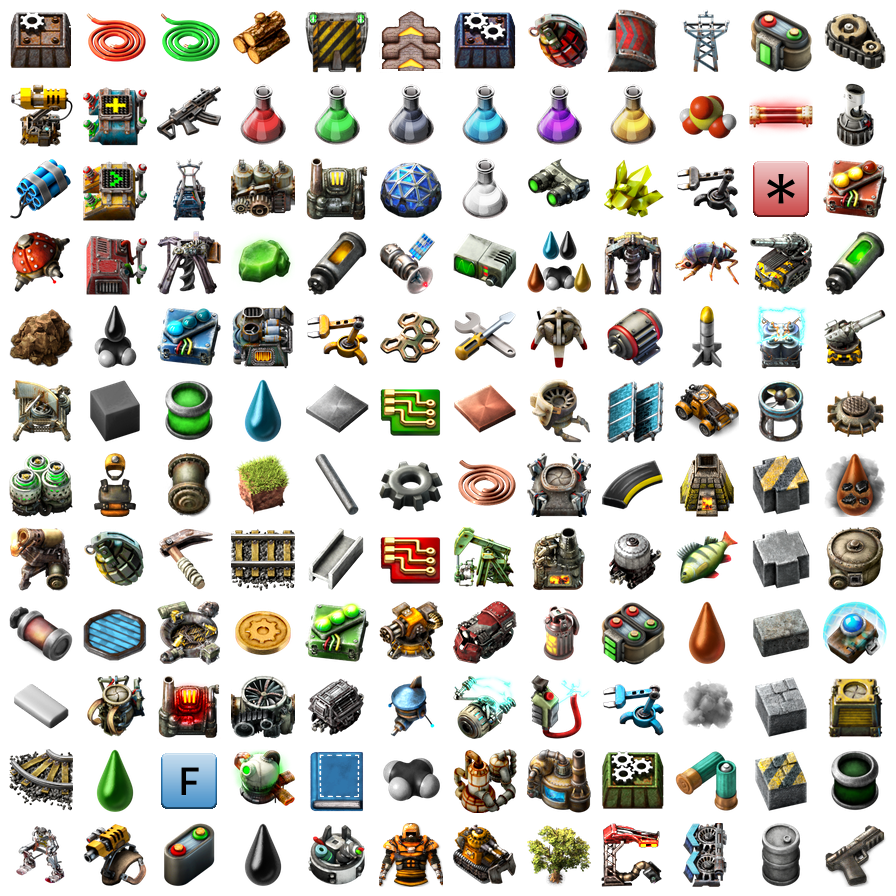

# FactorioGuide
A simple guide for [Factorio](https://www.factorio.com/).




## Prepare workspace in Visual Studio Code
Visit on websiste -> [LINK](https://code.visualstudio.com/docs/cpp/config-mingw)

## Compile programme:

### Windows
* cmd:
    ```
    start.bat
    ```
    
* Powershell:
    ```
    ./start.bat
    ```

### Linux
```
./start.sh
```

## Run application:

```
./run.exe
```

## Information source:
Visit on website -> [Factorio Wiki](https://wiki.factorio.com/)

## Tools for Tinkerers & Hackers:
Visit on website -> [https://manytools.org/hacker-tools/](https://manytools.org/hacker-tools/convert-images-to-ascii-art/)


